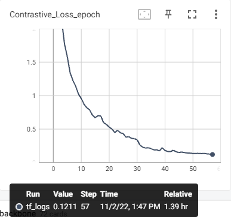
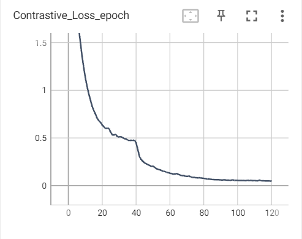

# Unsupervised-continual-place-recognition
## Problem definition
1. Joint training is expensive and sometimes impossible.
2. Massive data comes in sequence in the real world, we are unable to access previous data or all sequences at the same time.
3. When retraining a model on a different domain sequentially, catastrophic forgetting will be caused.
4. Labeling all the data is expensive and sometimes impossible.

## Baseline
**InCloud** has proposed a continual learning strategy for the sequential place recognition task. This strategy efficiently eliminates catastrophic forgetting. 

We plan to try unsupervised learning on unlabeled data in this sequential training process to avoid the expensive labeling process.

## Datasets
- Oxford
- Inhouse
- Mulran
- KITTI

## Place recognition methods
- MinkLoc3D
- Logg3d
- PointNetVLAD

## Experiments
<!-- ### Step 1
Train the model on the Oxford dataset.

Use the pre-trained model to infer global descriptors on the Inhouse dataset.

Generate pseudo labels (query, positive, negative) according to the distances between descriptors.
Train on the new dataset with pseudo-labeled tuples.

### Results
**no_retrain**: Supervised training on Oxford dataset, evaluation on Inhouse dataset directly.

**retrain_wo_cl**: Supervised training on Oxford dataset, supervised retrain on Inhouse dataset, no continual learning strategy is implemented.

**retrain_wi_cl**: Supervised training on Oxford dataset, supervised retrain on Inhouse dataset, continual learning strategy is implemented.

**joint_train**: Supervised training on Oxford dataset and Inhouse dataset jointly.

**unsuper_retrain_wo_cl**: our method, Supervised training on Oxford dataset, unsupervised retrain on Inhouse dataset, no continual learning strategy is implemented.

**unsuper_retrain_wi_cl**: our method, Supervised training on Oxford dataset, unsupervised retrain on Inhouse dataset, continual learning strategy is implemented.

| Recall@1 | Oxford | Business | Resident | University |
|----|---|---|---|---|
| no_retrain | 93.8 | 82.7 | 81.1 | 86.0 |
| retrain_wo_cl | 70.3 | 93.3 | 96.4 | 96.3 |
| retrain_wi_cl | 90.7 | 93.3 | 95.8 | 96.1 |
| joint_train | 94.8 | 94.0 | 96.7 | 97.2 |
| unsuper_retrain_wo_cl | 73.2 | 86.0 | 87.2 | 87.8 |
| unsuper_retrain_wi_cl | 90.0 | 86.1 | 88.2 | 90.8 |

The results show that pseudo labels generated by the pre-trained model will reduce catastrophic forgetting (**unsuper_retrain_wo_cl VS retrain_wo_cl**).

The performance of the new dataset, however, needs to be improved.

### Step 2
Update the pseudo labels dynamically after every epoch.

Compare the unsupervised method with 10% labeling, 20% labeling, etc.

**undate_retrain_wo_cl**: Supervised training on Oxford dataset, unsupervised retrain on Inhouse dataset, update the labels after each epoch, continual learning strategy is not implemented.

**undate_retrain_wi_cl**: Supervised training on Oxford dataset, unsupervised retrain on Inhouse dataset, update the labels after each epoch, continual learning strategy is implemented.

**retrain_wo_cl_0.x**: Supervised training on Oxford dataset, supervised retrain on Inhouse dataset with part of the labeled data, no continual learning strategy is implemented.

**contrastive_wo_cl**: Supervised training on Oxford dataset, retrain on Inhouse dataset in contrastive settings, no continual learning strategy is implemented.

**contrastive_wi_cl**: Supervised training on Oxford dataset, retrain on Inhouse dataset in contrastive settings, continual learning strategy is implemented.

| Recall@1 | Oxford | Business | Resident | University |
|----|---|---|---|---|
| undate_retrain_wo_cl | 41.0 | 71.9 | 76.2 | 71.6 |
| undate_retrain_wi_cl | 88.4 | 88.8 | 91.0 | 92.8 |
| retrain_wo_cl_0.9 | 69.4 | 93.7 | 95.4 | 96.3 |
| retrain_wo_cl_0.75 | 67.8 | 93.0 | 94.9 | 95.6 |
| retrain_wo_cl_0.5 | 68.9 | 93.0 | 94.4 | 95.9 |
| retrain_wo_cl_0.25 | 65.8 | 89.7 | 90.7 | 92.4 |
| retrain_wo_cl_0.1 | 55.3 | 83.9 | 85.0 | 84.4 |
| retrain_wo_cl_0.01 | 27.3 | 35.3 | 36.4 | 38.5 |
| contrastive_wo_cl | 44.2 | 75.4 | 77.1 | 77.2 |
| contrastive_wi_cl | 61.2 | 80.8 | 88.6 | 86.2 | -->

### 2022-10-13
We will use poses to divide positive and negative pairs.
1. Train with the contrastive learning strategy to improve the recall@1
2. contrastive continual learning to smoothly transfer among different datasets.

#### step1
there are two contrastive strategies
1. lightweight version: use negative miners, only 128 negatives
2. feature bank: train as moco, use ten thousands of negatives
3. from ablation study, we find t=0.07, m=0.99 is best

**Method**: MinkLoc3D

**oxford_triplet** : Training on the Oxford training pickle with triplet loss, evaluation on the Oxford and Inhouse evaluation pickles

**oxford_contrastive** : Training on the Oxford training pickle with contrastive loss, evaluation on the Oxford and Inhouse evaluation pickles
by temperature=0.07 batch=128, use projection head

**oxford_contrastive_featurebank** : Training on the Oxford training pickle with contrastive loss and feature bank, evaluation on the Oxford and Inhouse evaluation pickles(m=0.99,t=0.07,k=10000,batch=32, 120epochs, lr=0.001->0.0001->0.00001 [30,90])

**inhouse_triplet** : Training on the Inhouse training pickle with triplet loss, margin=0.2, evaluation on the Oxford and Inhouse evaluation pickles

**inhouse_contrastive_featurebank** : Training on the Inhouse training pickle with contrastive loss and feature bank, evaluation on the Oxford and Inhouse evaluation pickles(m=0.99,t=0.07,k=2000,batch=32)

**triplet_incremental** : SA loss and memory

**triplet_wo_incremental** : no SA loss and memory

**contrastive_incremental** : SA loss and memory

**contrastive_wo_incremental** : only memory

**contrastive_wo_incremental_and_memory** : no SA loss and memory

| Recall@1 | Oxford | Business | Resident | University |
|----|---|---|---|---|
| oxford_triplet_paper | 93.8 | 82.7 | 81.1 | 86.0 |
| oxford_triplet | 93.0 | 75.9 | 77.6 | 83.3 |
| oxford_contrastive | 88.3 | 81.6 | 83.0 | 85.3 |
| oxford_contrastive_featurebank | 91.2 | 84.7 | 84.3 | 88.0 |
| inhouse_triplet | 63.4 | 90.3 | 93.2 | 94.2 |
| inhouse_contrastive_featurebank | 68.9 | 92.3 | 95.1 | 96.3 |
| triplet_incremental | 90.7 | 93.3 | 95.8 | 96.1 |
| triplet_wo_incremental | 70.3 | 93.3 | 96.4 | 96.3 |
| contrastive_incremental | 80.7 | 92.3 | 94.1 | 95.4 |
| contrastive_wo_incremental | 77.1 | 93.0 | 94.8 | 95.4 |
| contrastive_wo_incremental_and_memory | 70.6 | 93.0 | 95.4 | 96.7 |

This is the training loss of inhouse_contrastive_featurebank

This is the training loss of oxford_contrastive_featurebank

### 2022-11-05
1. The generalization of contrastive training are much lower than that of triplet learning. 
2. The current incremental loss seems not so useful
3. The memory is more useful than incremental loss
4. if no memory and incremental loss, the recalls are almost same, which infers that the memory and incremental loss is not proper for contrastive learning